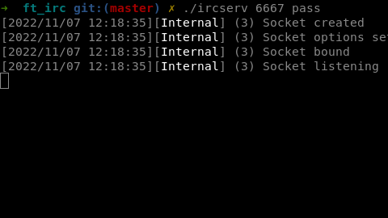

# Welcome to our ft_irc 42 project

The purpose of that project is to develop an IRC server in C++98.

## Table of content
1.[Requirements](#requirements)
2.[Restrictions](#restrictions)
3.[Using](#how-to-use-it)
4.[Config](#configuration-file)

## Requirements
* We must be able to authenticate, set a nickname, a username, join a channel, send and receive private messages.
* We must have operators and regular users.

## Restrictions
* The server must be capable of handling multiple clients at the same time and never hang.
* Forking is not allowed.
* All I/O operations must be non-blocking. Only 1 poll() (or equivalent) can be used for handling all these operations.
* Communication between client and server has to be done via TCP/IP (v4 or v6).

## How to use it
First you have to clone this repository. After that you need to run ```make``` in the repo.


Now you can launch the server with the command ```./ircserv <port> <password>```
* ```port```: The port number on which your IRC server will be listening to for incoming IRC connections.
* ```password```:  The connection password. It will be needed by any IRC client that tries to connect to your server.


## Configuration file
* ```server_name```: The name you want for your server.
* ```server_version```: The version of this code (normally 1.0)
* ```motd```: The path for your motd file.
* ```host```: The ip address for your server.
* ```max_user```: The maximum number of user that can be connected at the same time to your server.
* ```ping```: The time (in second) the server waits for inaction before ping a user.
* ```timeout```: The time (in second) the server waits before disconnect a user after a ping if the user didn't respond ```pong```.
* ```oper```: Pairs of ```name:password``` for operators separated by a coma. (oper = login:pass,login:pass,...)

## Credits
majacque (https://github.com/majacque)
jodufour (https://github.com/JonathanDUFOUR)
fcatinau (https://github.com/Balgor18)
